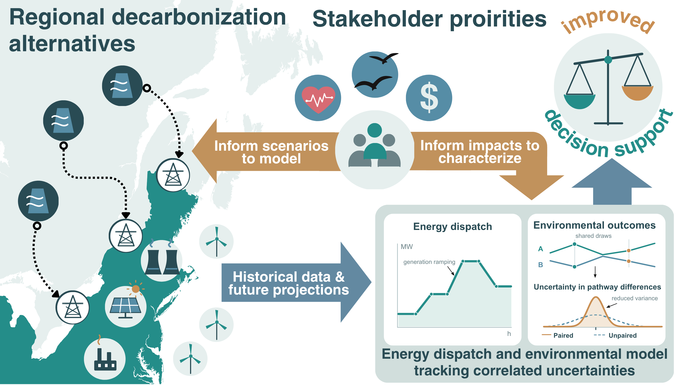

<h1 align="center">Probabilistic Hourly Assessment of Scenarios<br>for Electrical Decarbonization</h1>

<p align="center">
  <a href="https://amirgazar.github.io/us-powerplants-phased/index.html"></a>
  <a href="https://amirgazar.github.io/us-powerplants-phased/phased-model.html"></a>
  <a href="https://doi.org/10.31224/4684"></a>
</p>

<p align="center">
  <a href="#explore-the-model-and-data">Model and data</a> ·
  <a href="#what-the-model-does">Overview</a> ·
  <a href="#repository-guide">Repository guide</a> ·
  <a href="#running-the-analysis">Run the analysis</a> ·
  <a href="#relevant-studies-and-use-cases">Studies and use cases</a>
</p>

<p align="center"><strong>Hourly electricity modeling for decisions on costs, health and ecological impacts</strong></p>

## Relevant studies and use cases

**Correlated uncertainty propagation enables multi-impact decision support for electrical system decarbonization**

<p>
  Amir M. Gazar<sup>1,2</sup>, Chloe Jackson<sup>3</sup>, Georgia Mavrommati<sup>3</sup>, Rich B. Howarth<sup>4</sup>, Ryan S.D. Calder<sup>1,2,5,*</sup>
</p>

### Abstract

Decarbonization planning requires comparing electricity pathways across economic, ecological and health outcomes under uncertainty. We present PHASED (Probabilistic Hourly Assessment of Scenarios for Electrical Decarbonization), which simulates hourly electricity supply and compares prescribed pathways using the same sampled inputs. At a 2% discount rate, mean monetized costs across expansion pathways and costing methods range from $448.3 to $509.7 billion (2024 USD, 2025–2050). For eight New England pathways over 2025–2050, we compare uncertainty in absolute costs with uncertainty in paired differences across 1,000 simulations. The standard deviation of estimates of total cost differences across pathways is roughly 1/3 that of absolute costs for a given pathway. A pathway incorporating small modular nuclear reactors lowers total monetized costs relative to the “All Options” pathway retained as the baseline planning scenario by utilities and governments. Pathways with similar mean monetized costs also differ widely in air emissions and other ecological impacts known to be of interest to stakeholders including avian mortality and water withdrawals.

**Keywords:** decarbonization, energy system model, cost-benefit analysis, uncertainty quantification

<p align="center">
  
</p>
<p align="center"><em>Graphical abstract from the New England study.</em></p>

<details>
<summary>Affiliations and contact</summary>

<p>
  <sup>1</sup>Dept. of Population Health Sciences, Virginia Tech, Blacksburg, VA, 24061, USA<br/>
  <sup>2</sup>Global Change Center, Virginia Tech, Blacksburg, VA, 24061, USA<br/>
  <sup>3</sup>School for the Environment, University of Massachusetts Boston, Boston, MA, 02125, USA<br/>
  <sup>4</sup>Environmental Program, Dartmouth College, Hanover, NH, 03755, USA<br/>
  <sup>5</sup>Dept. of Civil & Environmental Engineering, Virginia Tech, Blacksburg, VA, 24061, USA<br/>
  <strong>* Contact:</strong> rsdc@vt.edu
</p>

</details>

---

## Explore the model and data

The companion website brings the power-plant database and PHASED resources together. Use it to find source data, inspect model components and access available output downloads.

<table>
<tr>
<td width="50%" valign="top">

### U.S. power-plant data

Find plants, inspect their reports and obtain generation and emissions data.

- [Search power plants and reports](https://amirgazar.github.io/us-powerplants-phased/datalookup.html)
- [Download state and national datasets](https://amirgazar.github.io/us-powerplants-phased/download.html)
- [Access historical EPA records](https://amirgazar.github.io/us-powerplants-phased/campd.html)

</td>
<td width="50%" valign="top">

### PHASED model resources

Follow the analysis from source inputs to model components and available results.

- [Browse the input catalogue](https://amirgazar.github.io/us-powerplants-phased/model-inputs.html)
- [Explore the interactive model diagram](https://amirgazar.github.io/us-powerplants-phased/model-components.html)
- [Browse model output downloads](https://amirgazar.github.io/us-powerplants-phased/model-outputs.html)

</td>
</tr>
</table>

> **Data access:** Large datasets are stored separately from the code. Each catalogue entry lists its download status, citation and reuse terms.

## What the model does

The analysis follows electricity supply and demand hour by hour across eight pathways: A, B1, B2, B3, C1, C2, C3 and D. It combines installed-capacity schedules, uncertain generation, electricity imports, storage operation and fossil-fuel dispatch. Power-plant emissions are calculated from the final operating conditions.

| Electricity system | Costs and damages | Ecological impacts |
| --- | --- | --- |
| Hourly generation and imports | Investment and operating costs | Land occupation |
| Storage and demand balance | Fuel and electricity purchases | Bird and bat mortality |
| Fossil-fuel operation and emissions | Climate and air-pollution damages | Water withdrawals |
| Unmet demand | Unmet-demand penalties | Visual impacts |

The full analysis uses 1,000 simulations. Shared draws preserve paired comparisons between pathways. Costs are evaluated at discount rates of 1.5%, 2% and 2.5%. Pathway B3 has two cost-accounting cases, giving nine cost presentations from eight dispatch pathways.

## Repository guide

| Folder | Contents |
| --- | --- |
| [0 Stochastic Power Plant Model](0%20Stochastic%20Power%20Plant%20Model/) | Historical plant-data preparation and probabilistic generation inputs. |
| [1 Decarbonization Pathways](1%20Decarbonization%20Pathways/) | Pathway definitions and hourly installed-capacity schedules. |
| [2 Generation Expansion Model](2%20Generation%20Expansion%20Model/) | Demand, generation, imports, random draws, dispatch and validation. |
| [3 Total Costs](3%20Total%20Costs/) | Thirteen cost components and shared cost-coefficient sampling. |
| [4 External Data](4%20External%20Data/) | Supporting source tables and reference material. |
| [5 Ecological impacts](5%20Ecological%20impacts/) | Ecological calculations and notebooks. |
| [6 Figures](6%20Figures/) | Figure scripts, notebooks and publication-table exports. |

## Running the analysis

Choose how to run the same PHASED scripts:

| Option | How it works |
| --- | --- |
| [**Manual run**](#option-1-manual-run) | Set the paths and run each stage yourself in R, Python or your computing cluster. |
| [**Using an AI Agent**](#option-2-using-an-ai-agent) | Open the repository in a coding assistant and use the supplied runner prompt to check inputs, run the selected stages and report results. |

Both options require the same software, data and computing resources.

### Option 1: Manual run

Use step 1 for a new setup. If you already have completed dispatch summaries, continue with step 4. Expand each step for its inputs, settings and commands.

<details>
<summary><strong>1. Set up the software and project paths</strong></summary>

The study used R 4.4.2. Figure scripts and notebooks also require Python 3. Scripts list their package imports. Main dependencies include:

- **R:** data.table, dplyr, tidyr, readxl, lubridate, zoo, sf, fredr, httr, htmltools, jsonlite and digest. Cluster controls also use ssh.
- **Python:** numpy, pandas, scipy, matplotlib and openpyxl.

Some preparation tools require additional packages. Package versions are not fully locked in this repository.

Open R or RStudio with this repository as the working directory, then set:

```r
Sys.setenv(
  PHASED_R1_ROOT = normalizePath(getwd()),
  PHASED_DATA_ROOT = normalizePath(getwd())
)
```

`PHASED_DATA_ROOT` can point to a separate input-data folder with the same numbered folder structure. Set `PHASED_PYTHON_R1` to your Python executable if it is not available on the system path. Run Python scripts from the repository root or set `PHASED_R1_ROOT` in their environment.

</details>

<details>
<summary><strong>2. Obtain and prepare the inputs</strong></summary>

Start with the [PHASED input catalogue](https://amirgazar.github.io/us-powerplants-phased/model-inputs.html) and the [power-plant datasets](https://amirgazar.github.io/us-powerplants-phased/download.html). Run the preparation scripts for the stages you need. Keep the same random columns across pathways when reproducing paired results.

Dispatch requires capacity schedules, facility tables, generation distributions, operating limits, wind and solar capacity factors, import profiles, hourly demand, random draws and the saved operating-emissions model. The [dispatch source](2%20Generation%20Expansion%20Model/5%20Dispatch%20Curve/dispatch_curve_base_v2.R) lists their relative paths in its data-loading section.

Large generated tables, including `Hourly_Installed_Capacity.csv`, `Fossil_Fuel_Generation_Emissions.csv` and `Random_Sequence.csv`, must be supplied or generated before a full run. The saved operating-emissions model must match its helper code and fleet input. Use the [calibration script](2%20Generation%20Expansion%20Model/5%20Dispatch%20Curve/2%20Advanced%20Research%20Computing/1%20ARC%20Codes/Support%20R1/0%20Calibrate%20Operating%20Emissions_R1.R) after changing those calculations or the fleet.

</details>

<details>
<summary><strong>3. Run dispatch and combine the results</strong></summary>

For a small local run, open [Run local review](2%20Generation%20Expansion%20Model/5%20Dispatch%20Curve/1%20Run%20local%20review_R1.R). Set the action, hours, start year and pathways. Its default is a 2,000-hour test in 2050 using simulation 1. Set `PHASED_RANDOM_FILE` to choose the saved random table. A partial run cannot supply the annual production cost analysis.

For full local runs, the [dispatch runner](2%20Generation%20Expansion%20Model/7%20Validation%20R1/run_dispatch_review_R1.R) accepts:

```text
ROOT DATA_ROOT INPUT_EXTRACT NEW_OUTPUT HOURS SIM_IDS fresh START_YEAR PATHWAYS
```

Use `HOURS=0` for the full supplied horizon, `START_YEAR=2025`, comma-separated simulation IDs, and `A,B1,B2,B3,C1,C2,C3,D` for all pathways. `INPUT_EXTRACT` must contain the selected original random columns. Choose a new output directory for each run.

For cluster runs, use [ARC Control](2%20Generation%20Expansion%20Model/5%20Dispatch%20Curve/2%20Advanced%20Research%20Computing/1%20ARC%20Codes/1%20ARC%20Control_R1.R). Configure the host, project, account, container and computing resources for your installation. Set a unique run name with `PHASED_RUN_NAME`. The menu provides separate actions for preparing files, uploading inputs, submitting jobs, checking progress, combining results and downloading summaries.

The [summary script](2%20Generation%20Expansion%20Model/5%20Dispatch%20Curve/2%20Advanced%20Research%20Computing/1%20ARC%20Codes/Support%20R1/6_Summarization_Code_Final_R1.R) combines completed runs using the selected run settings. The final summary folder must contain:

- `Yearly_Results.csv`
- `Yearly_Facility_Level_Results.csv`
- `Yearly_Results_Shortages.csv`
- `Coverage_and_accounting.csv`
- `SUMMARY_COMPLETE.txt`

</details>

<details>
<summary><strong>4. Calculate costs</strong></summary>

Point to the completed summary folder and run the [full cost pipeline](3%20Total%20Costs/Cost%20production%20audit%20R1/1%20Run%20full%20cost%20pipeline_R1.R):

```r
Sys.setenv(PHASED_FINAL_R1 = "/path/to/completed/Final")
source("3 Total Costs/Cost production audit R1/1 Run full cost pipeline_R1.R")
```

The runner checks all 1,000 simulations, eight dispatch pathways and years 2025 through 2050 before calculating costs. It runs the 13 components at each discount rate and writes results to a new folder. `Last_output_R1.txt` records the completed output location.

Run cost components through this entry script. It replaces their `__PROJECT_ROOT__` path markers with the selected inputs and output folders.

Required supporting inputs include the NREL ATB table at `4 External Data/NREL ATB/ATBe_2024.csv`, the CPI table in `3 Total Costs/0 Pilot Cost Sanity Checks R1/Inputs R1`, the county lookup in the cost runner's `Inputs R1` folder, and the external tables referenced by each component. The small validated AP4 coefficient tables are included under `3 Total Costs/5 Air Pollutant Emissions Costs/AP4_ARC/outputs/AP4_native_20260920_01/validated_tables`.

The default air-damage setting is `AP4_hybrid`. Set `PHASED_AIR_MODEL_R1` to use another supported valuation mode.

</details>

<details>
<summary><strong>5. Generate figures and tables</strong></summary>

Keep `PHASED_FINAL_R1` set to the same dispatch summaries, then run the [figure and table entry script](6%20Figures/Final%20results%20review%20R1/Run_figures_and_tables_R1.R):

```r
source("6 Figures/Final results review R1/Run_figures_and_tables_R1.R")
```

This stage reads the completed cost output and generates cost figures, annual summaries and ecological exhibits. It also requires the capacity workbook, county geometry, viewshed workbook and other reference inputs used by those scripts. The notebooks in folders 5 and 6 provide additional calculations and plots.

</details>

<details>
<summary><strong>Additional settings</strong></summary>

Historical data helpers use `PHASED_STATES_HISTORICAL_DATA`, `PHASED_SIMULATED_DATA_FACILITY_LEVEL`, `PHASED_SIMULATED_DATA_PARQUET`, `PHASED_ARC_SSH_FOSSIL_FUELS_USA`, `PHASED_AUTOMATION` and `PHASED_FOSSIL_FUELS_RDS` for their input or output locations. Set only the variables needed by the helper you are running. The separate AP4 cluster controller uses `PHASED_AP4_ARC`.

Supply EPA and FRED credentials through `EPA_API_KEY` and `FRED_API_KEY`. Keep credentials, saved R sessions, notebook checkpoints and large generated results outside version control.

</details>

### Option 2: Using an AI Agent

Use the [**PHASED guided study instructions**](phased-agent-runner.json) to work through study setup, data collection, analysis and results with a coding assistant. You can reproduce the New England study, change its assumptions, or plan a study for another region.

The assistant will ask a few questions at a time, inspect the files you already have, explain what is missing and guide you through the next step. You do not need to edit the JSON or know every input before starting. The JSON is an instruction file, not an executable program or a hosted service.

#### 1. Open the repository and provide the instructions

1. Clone [this repository](https://github.com/amirgazar/Decarbonization-Tradeoffs) using GitHub Desktop or Git.
2. Open the local repository folder in a coding assistant with file and command access. For Codex setup, use the [official quickstart](https://learn.chatgpt.com/docs/quickstart). Another coding assistant with suitable access can also follow these instructions.
3. Ask the assistant to read `phased-agent-runner.json` in the repository root. You can also open the [JSON file](phased-agent-runner.json), select **Download raw file**, and attach it to your task. Attaching the JSON alone does not provide access to code, datasets or a computing account.
4. Paste the starting prompt below. Fill in what you know and leave other items as “not sure.” The assistant should help resolve them before the affected stage starts.

<details>
<summary><strong>Copy this starting prompt</strong></summary>

```text
Read phased-agent-runner.json and README.md in this repository.
Guide me through the PHASED study workflow, a few questions at a time.

Here is what I know so far:
- Study question: [describe the decision or question]
- Study: [reproduce New England / modify New England / another region /
  explore feasibility / not sure]
- Region and study years: [details, or not sure]
- Results I need: [costs, emissions, health, ecological impacts, or not sure]
- Data or completed results I already have: [folders or links, or none]
- Computing: [local computer / hosted service or cluster / not sure]
- Hosted environment, if applicable: [service, access and resource limits]
- Who runs the code: [you run it, suggested / I run it myself / not sure]

Ask about missing study details, computing choices and execution
preferences before the relevant work. Inspect the files I already have.
Explain which New England inputs and assumptions can be reused and
which need replacement for my study.

Present the study plan and any proposed scientific changes. If you
cannot download a required file, give me a verified source link,
specific steps, where to save it and how to resume.

Follow the script sequence in the JSON. If you run the code, check each
stage's logs and outputs. If I run it, give me the exact files, settings
and commands for my environment, then help me verify the results.
Start with a suitable small check before a full run. Ask before large
downloads or paid computing unless I have already agreed to their scope.

Preserve existing files and results. Do not invent inputs, weaken checks
to hide errors or claim an unperformed run succeeded. Save the study
profile, data inventory, progress and run report so we can resume later.
Do not commit, push or publish without my instruction.
```

</details>

#### 2. Describe your study and choose how to run it

The assistant will first ask about your study question, region, years and desired results. It will then check whether you have suitable data, New England reference files, or completed results that can be reused.

| Choice | What to tell the assistant |
| --- | --- |
| **Study** | Reproduce New England, change the New England study, study another region, or explore feasibility only. |
| **Computing** | Your own computer or hosted computing. For hosted work, name the service or cluster and describe your available storage, resources and budget. If unsure, ask for help choosing. |
| **Who runs the code** | **Assistant runs it, suggested when it has the required access:** it runs the stages in order and checks logs and outputs. **I run it myself:** it provides the files, settings and commands one stage at a time, then helps check the results you provide. |

For a new region, such as Texas, the assistant must first clarify the electricity-system boundary and assess which inputs and code need to change. The current scripts implement a New England study. Changing a region name or the JSON settings alone does not adapt the model. The assistant should explain proposed scientific changes and obtain your agreement before running the affected calculations.

#### 3. Obtain data with guided help

The instructions link to the [input catalogue](https://amirgazar.github.io/us-powerplants-phased/model-inputs.html), [output catalogue](https://amirgazar.github.io/us-powerplants-phased/model-outputs.html) and [machine-readable catalogue](https://amirgazar.github.io/us-powerplants-phased/json/zenodo-public.json). Availability and regional suitability must be checked when you run the study.

The assistant should download suitable files when access and your agreed scope allow it. If a login, manual selection or unavailable tool prevents this, it should give you:

- The dataset name, why it is needed and a verified source link.
- The region, years, variables and format to select, where these are known.
- Download steps, a destination folder and any documented archive instructions.
- A clear way to resume after you provide the downloaded file's location.

It should then check the file's contents, coverage, units and available checksums. Missing data should pause the stages that depend on it, while independent work can continue.

#### 4. Review the plan, run a small check and continue

Before execution, the assistant should summarize your study, required data, proposed changes and computing needs. The JSON identifies the scripts and their run order, including input preparation, emissions calibration when needed, dispatch, summaries, the 13 cost components, and figures and tables.

Start with a small check suited to the selected study and computing environment. The assistant should use its measured resource needs to help plan a larger run. If you already have complete, verified dispatch summaries, it can begin with costs and figures after checking the required inputs.

For hosted computing, the instructions distinguish a cluster, a hosted machine and a managed service. The assistant should check the actual environment and access before giving commands. Agree on the scope and resource limits before large downloads or paid jobs.

> [!WARNING]
> AI agents can select unsuitable data, change calculations incorrectly or report success without completing a run. Review their commands, logs and results before using outputs in a publication. Large downloads and full runs can require substantial storage, time and computing funds. Give only the access needed, keep passwords and API keys out of chat, and check your provider's data policy before sharing unpublished material. The JSON cannot enforce these limits; use the assistant's permission controls. Agent assistance does not replace scientific review.

**What you should receive:** A study plan, a checked data inventory, clear progress and next steps, and a report stating what actually ran, which checks passed, where outputs are saved and what remains incomplete. When you return, ask the assistant to read the saved progress record and verify the files before continuing.

## Validation and interpretation

The [source-check workflow](.github/workflows/source-checks.yml) checks R and Python syntax, runs the operating-emissions tests and checks tracked file sizes. Dispatch and cost scripts also check input coverage, energy accounting and output consistency.

Syntax and unit checks do not replace a complete run with the required datasets. Annual accounting checks do not establish that every hourly storage, ramp or import constraint is satisfied. Separate weather-profile draws do not preserve joint weather, and storage input units must match the model's energy-capacity interpretation.


## License

This repository is distributed under [Creative Commons Attribution 4.0 International](LICENSE.txt). External datasets retain their own source-specific terms.

Copyright (c) 2025 Amir Gazar et al.
